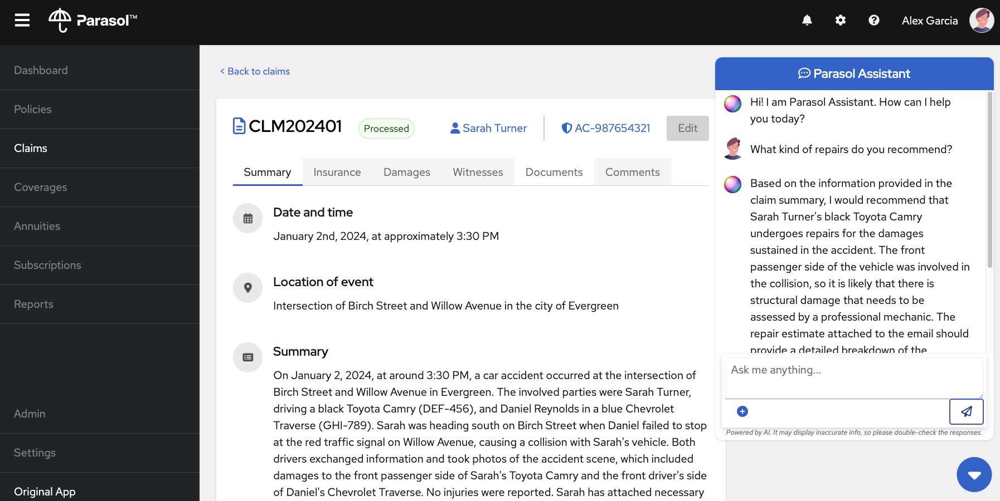

# Quarkus Agentic AI Workshop

A workshop to learn how to build Agentic AI applications with Quarkus and LangChain4j.

The workshop is divided into several steps. You can follow the instructions
available in the [workshop
website](https://quarkus.io/quarkus-workshop-agentic/). Alternatively,
you may serve the instructions locally by following the [docs/README
file](docs/README.md).

The final state of each step is available in the [step-XX](step-XX) directory.

## The application

A [Quarkus](https://quarkus.io) + [React](https://react.dev/) Agentic AI app for managing fictitious insurance claims. Uses [Quarkus Quinoa](https://docs.quarkiverse.io/quarkus-quinoa/dev/index.html) under the covers.



## Pre-requisites

- Java 21 or later -- Get it https://adoptium.net/  or install using your favorite package manager.
- Maven 3.9.6 or later -- Get it https://maven.apache.org/download.cgi or install using your favorite package manager.
    - Or just use the embedded [Maven Wrapper](https://maven.apache.org/wrapper)
- An OpenAI-capable LLM inference server.

Then:

```
cd app;
./mvnw clean quarkus:dev
```
App will open on `http://0.0.0.0:8005`.
